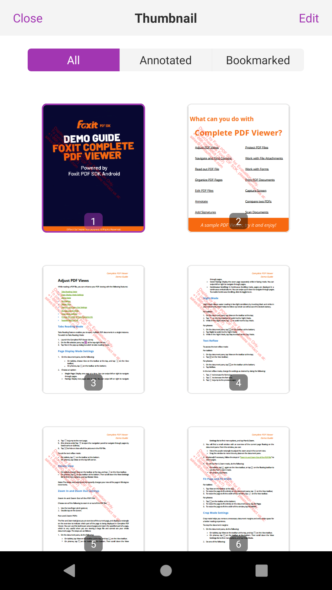
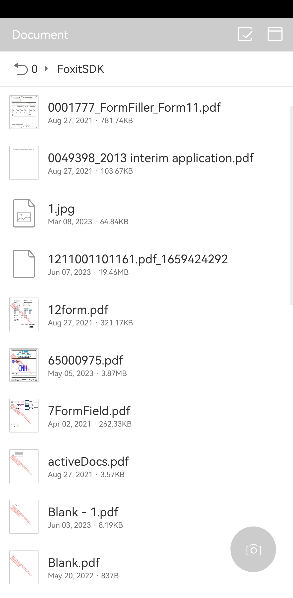
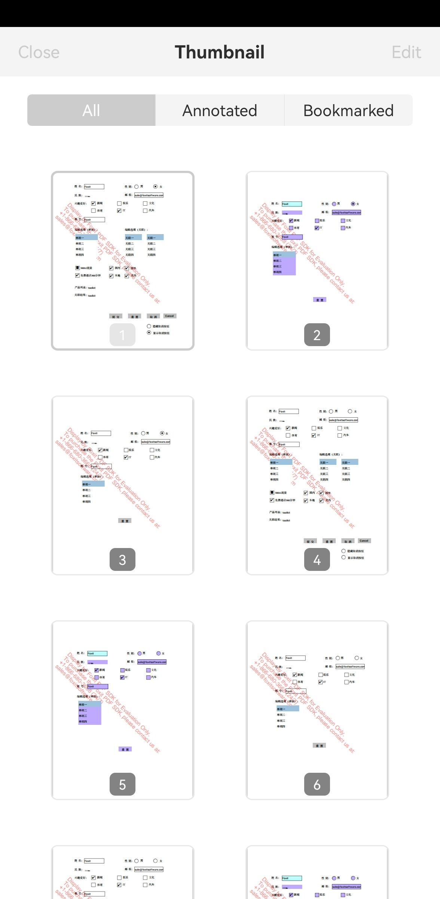

# 如何修改主题色

RDK默认的主题色是紫色 (0xffA236B2)：




```code
import com.foxit.uiextensions.theme.ThemeConfig;

// Value format for "new_color" should be 0xaarrggbb.If use 0xrrggbb, that means 0xFFrrggbb.
ThemeConfig.getInstance(getApplicationContext()).primaryColor(new_color);
```

注意：
* ThemeConfig并未导出到API reference，也就是没有注释说明。
* 它的颜色值，格式为0xaarrggbb；如果仅写0xaarrggbb，相当于alpha通道为FF。
* 该方法执行后，主题色才会发生变化。建议在app初始化或初始创建时就调用。


例如： new_color = Color.LTGRAY (0xFFCCCCCC)




