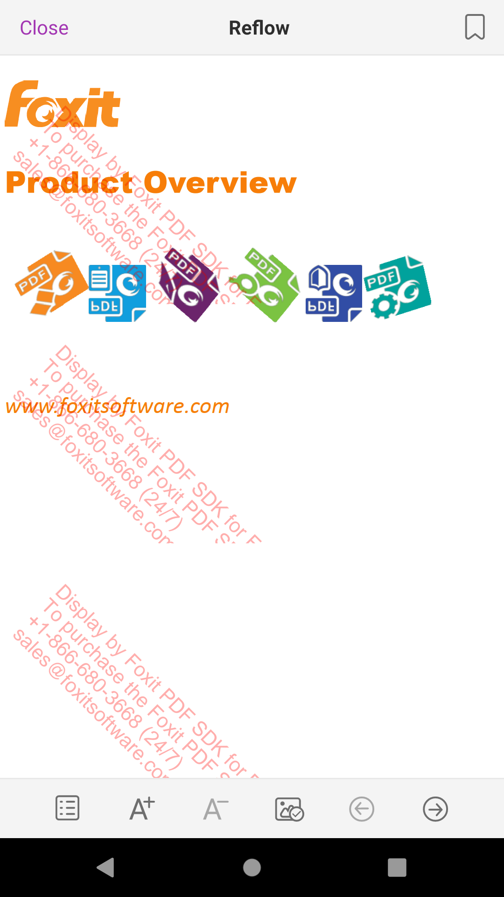

# 如何切换工具

### 1.切换工具，如画笔

```code
ToolHandler toolHandler = mUiExtensionsManager.getToolHandlerByType(ToolHandler.TH_TYPE_INK);
mUiExtensionsManager.setCurrentToolHandler(toolHandler);
```
工具的名称可以参考  `com.foxit.uiextensions.ToolHandler`


### 2.可以通过  `com.foxit.uiextensions.UIExtensionsManager#changeState` 来切换不同的状态， 如 reflow

```code
uiExtensionsManager.changeState(ReadStateConfig.STATE_REFLOW);
```

目前主要有以下几种状态`com.foxit.uiextensions.pdfreader.config.ReadStateConfig`:
```code
public class ReadStateConfig {
    public static final int STATE_NORMAL = 1;
    public static final int STATE_REFLOW = 2;
    public static final int STATE_SEARCH = 3;
    public static final int STATE_PANZOOM = 4;
    public static final int STATE_COMPARE = 5;
    public static final int STATE_TTS = 6;
    public static final int STATE_FILLSIGN = 7;
    public static final int STATE_AUTOFLIP = 8;
    public static final int STATE_REDACT = 9;
}
```

### 3.可以通过  `samples/complete_pdf_viewer/app/src/main/res/raw/uiextensions_config.json` 来配置， 如 reflow

```code
{
  ...
  "uiSettings": {
    "pageMode": "Reflow",
    ...
    },
  ...
}
```  

