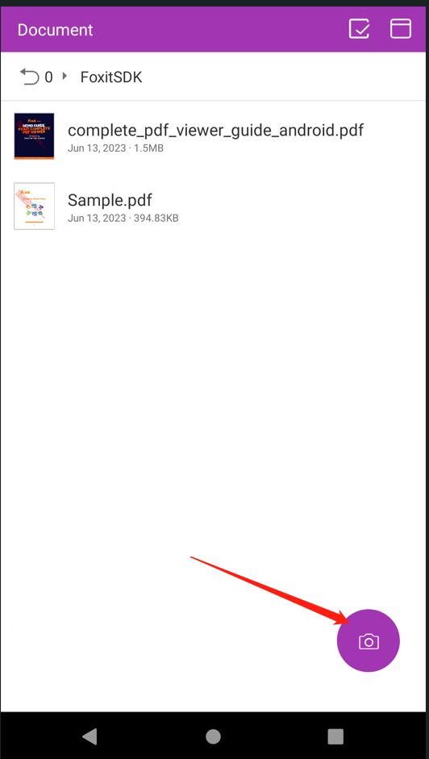

# 如何删除相机图标


RDK提供的`samples/complete_pdf_viewer`中，初始界面的右下角有个相机图标：(截图借用Android RDK）

这是Scan功能。


## 仅移除相机图标

*com.foxit.home.HomeFragment#onCreateView()*
与 `mIvScan` 相关的都注释掉
```code
   ...
   //mIvScan.setLayoutParams(layoutParams);
   //mRootView.addView(mIvScan);
   ...
```

## 去掉Scan功能

如果还想将Scan功能里彻底移除的话,
包中`/docs/developer_guide_android.pdf`文档里，有教如何将加入Scan功能：
* `3.2 Integrate Foxit PDF SDK for Android into your apps`
* `3.7 Add the scanning feature based on the full-featured PDF Reader`  

可以参考这部分说明，并将相关的库和代码都去掉，就能从`samples/complete_pdf_viewer`里去掉Scan功能了。