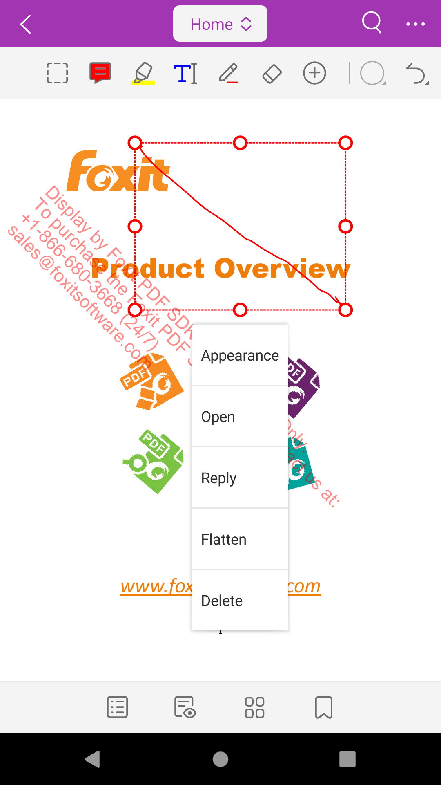
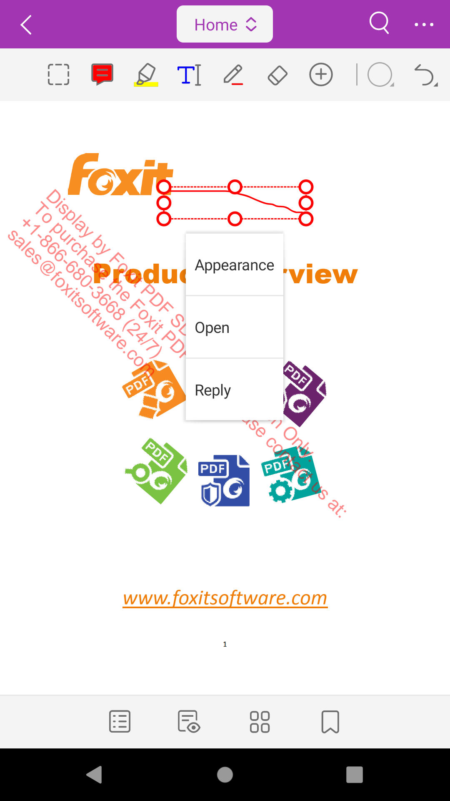

# 如何屏蔽注释右键菜单中菜单项

## 通过接口屏蔽canModify、canDelete、canReply菜单

没有做修改前画笔注释菜单如图：


想要将右键菜单中回复、删除项屏蔽，可以通过 `UIExtensionsManager#setAnnotationPermission` 接口来实现，对应菜单项 `return false`
```code
 mUiExtensionsManager.setAnnotationsPermission(new IAnnotationsPermission() {
            @Override
            public boolean canAdd() {
                return true;
            }

            @Override
            public boolean canModify() {
                return false;
            }

            @Override
            public boolean canDelete() {
                return false;
            }
        });
```

设置后结果如图：
